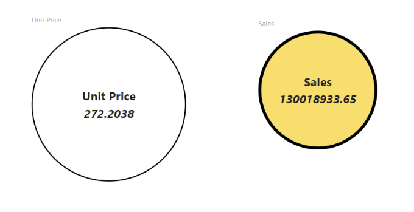

# Circle Card React Custom Visual

> Demo Custom Visual using React JS

# Overview

This repository represents a simple way to use React for development of Power BI Custom Visuals. Shows a simple Bar Chart.

React-based Custom Visual development basics are explained in [this tutorial](https://microsoft.github.io/PowerBI-visuals/tutorials/building-react-based-custom-visual/getting-started/). It describes step-by-step creation of Circle Card. You're welcome to use that example as a base to your own Custom Visuals by cloning this repository or using `pbiviz new react` command of [Power BI Visuals Tools](https://github.com/Microsoft/PowerBI-visuals-tools).
